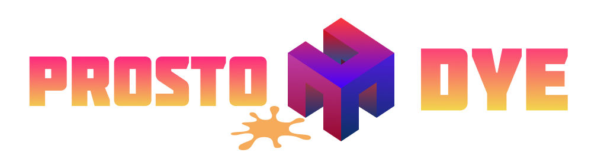
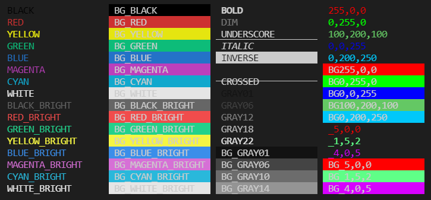

<p align="center">

<a  href="https://github.com/prostojs/dye/blob/main/LICENSE">
    
</a>
    
</p>

Got sick of `chalk` or other coloring libraries?

Here's **easy and light** console styling tool. 🔥🔥🔥 Create **your styles** and reuse them easily. 💙💚💛💗

Supports plain colors, modifiers, **256 color mode** and **true color mode** (16m colors)

## Install

`npm install @prostojs/dye`

## Usage

```js
import { dye } from '@prostojs/dye'

const bold = dye('BOLD')
console.log(bold('Text In Bold'))
// Text in Bold
```



## Colors and modifiers
Function `dye` returns a `style` function based on input arguments.
You can pass arguments in any order.

Supported arguments _(IDE will help as it's all well typed with TS)_:
1. Plain colors: `BLACK`, `RED`, `GREEN`, `YELLOW`, `BLUE`, `MAGENTA`, `CYAN`,`WHITE`;
2. Prefix `BG_` turns color to background color (`BG_RED`);
3. Suffix `_BRIGHT` makes color brighter (`RED_BRIGHT`, `BG_RED_BRIGHT`);
4. Grayscale colors: `[BG_]GRAY<01..22>` (`GRAY01`, `GRAY02`, ..., `GRAY22`, `BG_GRAY01`, `BG_GRAY02`, ..., `BG_GRAY22`);
5. Modifiers: `BOLD`, `DIM`, `ITALIC`, `UNDERSCORE`, `INVERSE`, `HIDDEN`, `CROSSED`;
6. RGB 256 mode `_5,0,0`, `BG_5,0,0`;
7. RGB True Color mode `255,0,0`, `BG255,0,0`.

### 256 RGB version:
```js
dye('_5,0,0') // red 256
dye('BG_5,0,0') // red 256 background
```

### True Color RGB:
```js
dye('255,0,0') // red True Color
dye('BG255,0,0') // red True Color background
```

### Simple example
```js
const bold = dye('BOLD')
console.log(bold('Text In Bold'))
```

### Advanced example
```js
const myStyle = dye('ITALIC', 'BG_RED', '0,0,255')
console.log(myStyle('Styled italic blue text with red BG'))
```

### Super advanced example 😀

```js
const { dye } = require('../dist/dye.cjs.prod')

const myStyle = dye('ITALIC', 'BG_RED', '0,0,255')
console.log(myStyle.open)
console.log('Italic blue text with red background')
console.log(myStyle.close)
```

### Strip the styles away
```js
const { dye } = require('../dist/dye.cjs.prod')

const myStyle = dye('ITALIC', 'BG_RED', '0,0,255')
const styledText = myStyle('Styled text')
console.log(styledText) // styles applied
console.log(dye.strip(styledText)) // styles removed
```
