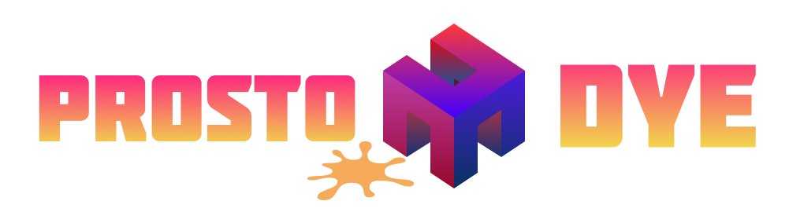
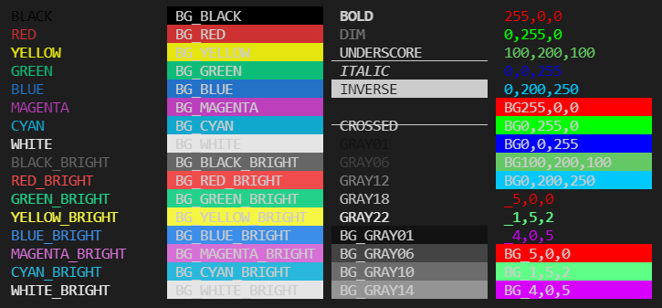
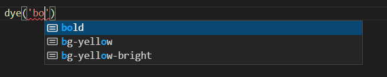
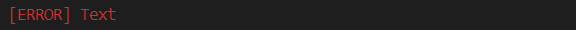
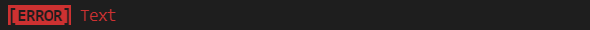
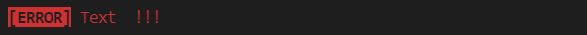
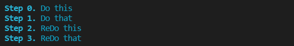
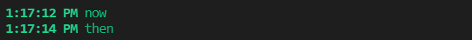
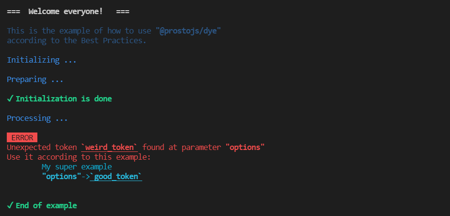

<p align="center">

<a  href="https://github.com/prostojs/dye/blob/main/LICENSE">
    
</a>
    
    
</p>

Got sick of `chalk` or other coloring libraries?

Hate this? ~~`console.warn(chalk.bold(chalk.yellow('text')))`~~

Me too!

**Try this:**

```js
const warn = dye('bold', 'yellow').attachConsole('warn')
warn('text')
```

This is an **easy and light** console styling tool. 🔥🔥🔥 Create **your styles** and reuse them easily. 💙💚💛💗

Supports plain colors, modifiers, **256 color mode** (incl. _`hex`_) and **true color mode** (16m colors)

## Install

npm: `npm install @prostojs/dye`

## Usage

A very basic "chalk" way to dye

```js
import { dye } from '@prostojs/dye'

const bold = dye('bold')
console.log(bold('Text In Bold'))
// Text in Bold
```



## Colors and modifiers

Function `dye` returns a `style` function based on input arguments.
You can pass arguments in any order.

Supported arguments:

1. Plain colors: `black`, `red`, `green`, `yellow`, `blue`, `magenta`, `cyan`,`white`;
2. Prefix `bg-` turns color to background color (`bg-red`);
3. Suffix `-bright` makes color brighter (`red-bright`, `bg-red-bright`);
4. Grayscale colors: `[bg-]gray<01..22>` (`gray01`, `gray02`, ..., `gray22`, `bg-gray01`, `bg-gray02`, ..., `bg-gray22`);
5. Modifiers: `bold`, `dim`, `italic`, `underscore`, `inverse`, `hidden`, `crossed`;
6. RGB 256 mode `*5,0,0`, `bg*5,0,0`;
7. RGB True Color mode `255,0,0`, `bg255,0,0`.
8. RGB True Color mode (_HEX_) `#ff0000`, `bg#ff0000`, `#f00`, `bg#f00`.

IDE will help wtih typing as it's all well typed with TS


### 256 RGB version:

```js
dye('*5,0,0') // red 256
dye('bg*5,0,0') // red 256 background
```

### True Color RGB:

```js
dye('255,0,0') // red True Color
dye('bg255,0,0') // red True Color background
```

### Simple example

```js
const bold = dye('bold')
console.log(bold('Text In Bold'))
```

### Advanced example

```js
const myStyle = dye('italic', 'bg-red', '0,0,255')
console.log(myStyle('Styled italic blue text with red BG'))
```

### Super advanced example 😀

```js
const { dye } = require('@prostojs/dye')

const myStyle = dye('italic', 'bg-red', '0,0,255')
console.log(myStyle.open)
console.log('Italic blue text with red background')
console.log(myStyle.close)
```

## Tricks and tips

Let's get to some serious stuff like static prefix/suffix, dynamic prefix/suffix and attach console option.

### Static Prefix/Suffix

Let's add prefix and attach console.

```js
const error = dye('red')
  // we want a banner [ERROR] to appear each time
  .prefix('[ERROR]')
  // if we want to call console.error we must
  // pass 'error' otherwise by default it will
  // call console.log
  .attachConsole('error')
error('Text')
// [ERROR] Text
```



Now let's make prefix prettier

```js
const error = dye('red').prefix(dye('bold', 'inverse')('[ERROR]')).attachConsole()
error('Text')
// [ERROR] Text
```



If we need some suffix, there we go

```js
const error = dye('red').prefix(dye('bold', 'inverse')('[ERROR]')).suffix('!!!').attachConsole()
error('Text')
// [ERROR] Text !!!
```



### Dynamic Prefix/Suffix

Let's imagine you push some process steps to log. You want it to be pretty. You want it to have counter. Try this:

```js
let n = 0
const bold = dye('bold')
const step = dye('cyan')
  // pass a function as prefix that returns Step <n>
  .prefix(() => bold('Step ' + n++ + '.'))
  .attachConsole()

step('Do this')
step('Do that')
step('ReDo this')
step('ReDo that')
// Step 0. Do this
// Step 1. Do that
// Step 2. ReDo this
// Step 3. ReDo that
```



Sometimes it's usefull to log the time as well. it's easy:

```js
const bold = dye('bold')
const timedLog = dye('green')
  .prefix(() => bold(new Date().toLocaleTimeString()))
  .attachConsole('debug')

timedLog('now')
setTimeout(() => timedLog('then'), 2000)
// 1:17:12 PM now
// 1:17:14 PM then
```



### Strip the styles away

In case if you want to strip the colors away for some reason...

```js
const { dye } = require('@prostojs/dye')

const myStyle = dye('italic', 'bg-red', '0,0,255')
const styledText = myStyle('Styled text')
console.log(styledText) // styles applied
console.log(dye.strip(styledText)) // styles removed
```

## Best practices

Use semantic names for you styles and not color/modifiers names.

Let's assume we're working on some CLI that leads you through some process.

```js
const { dye } = require('@prostojs/dye')

// first we define some styles we're going to use
const style = {
  example: dye('cyan'),
  keyword: dye('bold', 'underscore').prefix('`').suffix('`'),
  name: dye('bold').prefix('"').suffix('"'),
}

// second we define an output message types
const print = {
  header: dye('bold').prefix('\n===  ').suffix('  ===\n').attachConsole(),
  hint: dye('dim', 'blue-bright').attachConsole('info'),
  step: dye('blue-bright').prefix('\n').suffix('...').attachConsole(),
  done: dye('green', 'bold').prefix('\n✓ ').attachConsole(),
  error: dye('red-bright')
    .prefix('\n' + dye('inverse')(' ERROR ') + '\n')
    .suffix('\n')
    .attachConsole('error'),
}

// here we go informing user on what's going on
print.header('Welcome everyone!')
print.hint(
  'This is the example of how to use',
  style.name('@prostojs/dye'),
  '\naccording to the Best Practices.'
)
print.step('Initializing')
print.step('Preparing')
print.done('Initialization is done')
print.step('Processing')

// an error occured!
print.error(
  'Unexpected token',
  style.keyword('weird_token'),
  'found at parameter',
  style.name('options'),
  '\nUse it according to this example:\n',
  style.example(
    '\tMy super example\n\t' + style.name('options') + '->' + style.keyword('good_token')
  )
)

// we're done
print.done('End of example')
```

Here's what we've got in the console:



## Formatting

Formatting is a very advanced feature which provides a very flexible text formatter.

If you're using typescript you can type your console arguments:

```ts
import { dye } from '@prostojs/dye'
// For this example want our Stylist to accept two
// arguments with string and number types
type Format = [string, number]

// Pass the format to dye stylist factory
const style = dye<Format>('bold')
  // and define the format function which can do
  // whatever you want; in this particular example
  // we will just repeat the input <n> times
  .format((s, n) => s.repeat(n))

// Now TS knows which arguments it should expect (string, number)
console.log(style('TEST_', 5))
// console output:
// TEST_TEST_TEST_TEST_TEST_
```

Take a look at more complex example, where we create a banner console output. Of course you can add more formatting to it, add wrapping if line is too long etc...

```js
const { dye } = require('@prostojs/dye')

const bold = dye('bold')
const bgBlue = dye('bg-blue')

const bannerTop = bgBlue
  .prefix('┌')
  .suffix('┐')
  .format(width => '─'.repeat(width - 2))
const bannerLine = bgBlue
  .prefix('│')
  .suffix('│')
  .format(width => ' '.repeat(width - 2))
const bannerBottom = bgBlue
  .prefix('└')
  .suffix('┘')
  .format(width => '─'.repeat(width - 2))
const bannerSeparator = bgBlue
  .prefix('├')
  .suffix('┤')
  .format(width => '─'.repeat(width - 2))
const bannerCenterText = bgBlue
  .prefix('│')
  .suffix('│')
  .format((text, w) => {
    const tLength = dye.strip(text).length
    const l = Math.round(w / 2 - tLength / 2) - 1
    return ' '.repeat(l) + text + ' '.repeat(w - l - tLength - 2)
  })

const banner = dye()
  .prefix((title, { width: w }) => bannerTop(w) + '\n' + bannerLine(w) + '\n')
  .format((title, { width: w }) => bannerCenterText(bold(title), w) + '\n')
  .suffix(
    (title, { width: w, separator }) =>
      bannerLine(w) + '\n' + (separator ? bannerSeparator(w) : bannerBottom(w)) + '\n'
  )
  .attachConsole()

banner('Hello World!', { width: 60 })
```

Console output:


## Build-time replacements (`__DYE_*__`)

dye exposes a set of ambient globals like `__DYE_RED__`, `__DYE_BG_BLUE__`, `__DYE_BOLD__`, etc., that map to ANSI escape sequences. These are intended to be replaced at build time so the resulting bundle contains only the inline strings — no per-call function overhead and no extra runtime branching.

You don't need to wire `define` manually: dye ships ready-made plugins for the common bundlers.

### TypeScript types

The `__DYE_*__` ambient declarations are exposed from the package's main types entry. Anywhere you `import` from `@prostojs/dye`, TypeScript can also see the globals — no extra `compilerOptions.types` entry required.

> **Older versions** also shipped a separate sub-path `@prostojs/dye/global` that consumers added to `compilerOptions.types`. That entry is still available for back-compat but is no longer needed.

### Vite

```js
// vite.config.ts
import { defineConfig } from 'vite'
import dye from '@prostojs/dye/vite'

export default defineConfig({
  plugins: [dye()],
})
```

### Rolldown

```js
// rolldown.config.ts
import { defineConfig } from 'rolldown'
import dye from '@prostojs/dye/rolldown'

export default defineConfig({
  plugins: [dye()],
})
```

> **The plugin is self-sufficient.** It registers the full `__DYE_*__` map under `transform.define`, so you do **not** need to also pass `createDyeReplacements()` into your bundler's top-level `define` option. The two are redundant — pick one or the other (the plugin is preferred).

### Manual `define` (other bundlers)

For bundlers without a dedicated plugin, use the `createDyeReplacements()` helper from the `/common` sub-path:

```js
import { createDyeReplacements } from '@prostojs/dye/common'

// in your bundler config:
define: { ...createDyeReplacements() }
```

### Test mode (strip styling)

Test runners typically want the same `define` setup so dye-using code doesn't hit `ReferenceError`, but with no actual styling — keeping snapshots clean and output uncluttered. Pass `strip: true`:

```js
// vitest.config.ts
import { defineConfig } from 'vitest/config'
import { createDyeReplacements } from '@prostojs/dye/common'

export default defineConfig({
  define: createDyeReplacements({ strip: true }),
})
```

## Lint integrations

dye ships a generated manifest of every `__DYE_*__` global plus shareable lint configs, so you don't have to maintain the list by hand.

- **Raw manifest**: `@prostojs/dye/globals.json` — `Record<string, "readonly">` (same shape consumed by ESLint's `globals` config).
- **oxlint**: `@prostojs/dye/oxlint` — drop-in `extends` target for `.oxlintrc.json`.
- **ESLint flat config**: `@prostojs/dye/eslint` — exports a config block with `languageOptions.globals`.

```js
// eslint.config.js
import dyeGlobals from '@prostojs/dye/eslint'
export default [dyeGlobals /* ...your other configs */]
```

```jsonc
// .oxlintrc.json
{
  "extends": ["@prostojs/dye/oxlint"]
}
```

The manifests are regenerated on every `pnpm build`, so when dye adds a new color or modifier, consumers pick it up automatically on upgrade.

## Runtime fallback (no build replacement)

If your code runs without a build step that performs the `__DYE_*__` replacement — for example `ts-node` / `tsx` quick scripts, an unconfigured test runner, or directly importing `src/` through a bundler that doesn't have the dye plugin — `__DYE_*__` references throw `ReferenceError` at runtime.

Two side-effect imports are provided as escape hatches. Import once at the very top of your app entry:

```js
// Real ANSI values — colors still work
import '@prostojs/dye/runtime-fallback'
```

```js
// Empty strings — no styling, useful for tests / snapshots
import '@prostojs/dye/runtime-fallback/strip'
```

The default (`runtime-fallback`) skips any `__DYE_*__` already populated as a non-empty string, so it's safe to leave in place even if some entries are also being replaced at build time.
