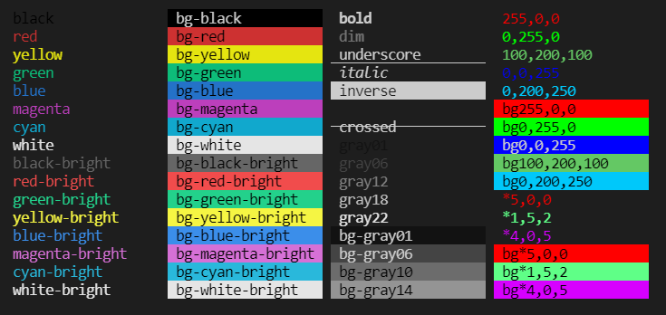

<p align="center">

<a  href="https://github.com/prostojs/dye/blob/main/LICENSE">
    
</a>
    
    
</p>

Got sick of `chalk` or other coloring libraries?

Hate this? ~~`console.warn(chalk.bold(chalk.yellow('text')))`~~

Me too!

**Try this:**
```js
const warn = dye('bold', 'yellow').attachConsole('warn')
warn('text')
```

This is an **easy and light** console styling tool. 🔥🔥🔥 Create **your styles** and reuse them easily. 💙💚💛💗

Supports plain colors, modifiers, **256 color mode** (incl. _`hex`_) and **true color mode** (16m colors) 

## Install

npm: `npm install @prostojs/dye`

Via CDN: `<script src="https://unpkg.com/@prostojs/dye"></script>`

## Usage

A very basic "chalk" way to dye
```js
import { dye } from '@prostojs/dye'

const bold = dye('bold')
console.log(bold('Text In Bold'))
// Text in Bold
```



## Colors and modifiers
Function `dye` returns a `style` function based on input arguments.
You can pass arguments in any order.

Supported arguments:
1. Plain colors: `black`, `red`, `green`, `yellow`, `blue`, `magenta`, `cyan`,`white`;
2. Prefix `bg-` turns color to background color (`bg-red`);
3. Suffix `-bright` makes color brighter (`red-bright`, `bg-red-bright`);
4. Grayscale colors: `[bg-]gray<01..22>` (`gray01`, `gray02`, ..., `gray22`, `bg-gray01`, `bg-gray02`, ..., `bg-gray22`);
5. Modifiers: `bold`, `dim`, `italic`, `underscore`, `inverse`, `hidden`, `crossed`;
6. RGB 256 mode `*5,0,0`, `bg*5,0,0`;
8. RGB True Color mode `255,0,0`, `bg255,0,0`.
9. RGB True Color mode (_HEX_) `#ff0000`, `bg#ff0000`, `#f00`, `bg#f00`.

IDE will help wtih typing as it's all well typed with TS


### 256 RGB version:
```js
dye('*5,0,0') // red 256
dye('bg*5,0,0') // red 256 background
```

### True Color RGB:
```js
dye('255,0,0') // red True Color
dye('bg255,0,0') // red True Color background
```

### Simple example
```js
const bold = dye('bold')
console.log(bold('Text In Bold'))
```

### Advanced example
```js
const myStyle = dye('italic', 'bg-red', '0,0,255')
console.log(myStyle('Styled italic blue text with red BG'))
```

### Super advanced example 😀

```js
const { dye } = require('../dist/dye.cjs.prod')

const myStyle = dye('italic', 'bg-red', '0,0,255')
console.log(myStyle.open)
console.log('Italic blue text with red background')
console.log(myStyle.close)
```

## Tricks and tips

Let's get to some serious stuff like static prefix/suffix, dynamic prefix/suffix and attach console option.

### Static Prefix/Suffix
Let's add prefix and attach console.
```js
const error = dye('red')
                // we want a banner [ERROR] to appear each time
                .prefix('[ERROR]')
                // if we want to call console.error we must 
                // pass 'error' otherwise by default it will
                // call console.log
                .attachConsole('error')
error('Text')
// [ERROR] Text
```


Now let's make prefix prettier
```js
const error = dye('red')
                .prefix(dye('bold', 'inverse')('[ERROR]'))
                .attachConsole()
error('Text')
// [ERROR] Text
```


If we need some suffix, there we go
```js
const error = dye('red')
                .prefix(dye('bold', 'inverse')('[ERROR]'))
                .suffix('!!!')
                .attachConsole()
error('Text')
// [ERROR] Text !!!
```


### Dynamic Prefix/Suffix
Let's imagine you push some process steps to log. You want it to be pretty. You want it to have counter. Try this:
```js
let n = 0
const bold = dye('bold')
const step = dye('cyan')
                // pass a function as prefix that returns Step <n>
                .prefix(() => bold('Step ' + (n++) +  '.'))
                .attachConsole()

step('Do this')
step('Do that')
step('ReDo this')
step('ReDo that')
// Step 0. Do this  
// Step 1. Do that  
// Step 2. ReDo this  
// Step 3. ReDo that 
```


Sometimes it's usefull to log the time as well. it's easy:
```js
const bold = dye('bold')
const timedLog = dye('green')
                    .prefix(() => bold(new Date().toLocaleTimeString()))
                    .attachConsole('debug')

timedLog('now')
setTimeout(() => timedLog('then'), 2000)
// 1:17:12 PM now  
// 1:17:14 PM then 
```


### Strip the styles away
In case if you want to strip the colors away for some reason...
```js
const { dye } = require('../dist/dye.cjs.prod')

const myStyle = dye('italic', 'bg-red', '0,0,255')
const styledText = myStyle('Styled text')
console.log(styledText) // styles applied
console.log(dye.strip(styledText)) // styles removed
```
